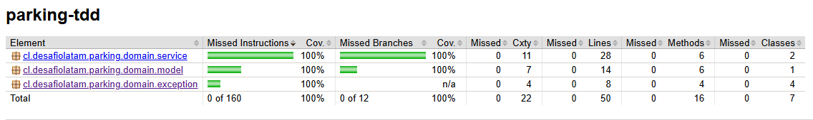

# Parking TDD

Proyecto educativo desarrollado para el primer hito de Desafío Latam. Modela
el dominio puro de un estacionamiento y demuestra el ciclo
RED-GREEN-REFACTOR mediante pruebas unitarias.

## Dominio de negocio

El sistema cubre dos casos de uso:

1. Registrar la entrada de un vehículo.
2. Registrar su salida y calcular el monto a pagar según la duración de la
   estadía.

La política tarifaria y las reglas detalladas del dominio están documentadas
en [PROJECT.md](PROJECT.md).

## Arquitectura

El proyecto utiliza una arquitectura simple de Ports and Adapters.

### Estructura del proyecto

```text
desafio-latam-parking-tdd/
├── docs/
│   └── images/
│       └── jacoco-coverage.png
├── src/
│   ├── main/
│   │   └── java/cl/desafiolatam/parking/domain/
│   │       ├── exception/
│   │       │   ├── ActiveParkingStayNotFoundException.java
│   │       │   ├── InvalidExitTimeException.java
│   │       │   ├── InvalidParkingDurationException.java
│   │       │   └── VehicleAlreadyParkedException.java
│   │       ├── model/
│   │       │   └── ParkingStay.java
│   │       ├── port/
│   │       │   └── ParkingStayRepository.java
│   │       └── service/
│   │           ├── ParkingFeeCalculator.java
│   │           └── ParkingService.java
│   └── test/
│       └── java/cl/desafiolatam/parking/domain/
│           ├── model/
│           │   └── ParkingStayTest.java
│           └── service/
│               ├── ParkingFeeCalculatorTest.java
│               └── ParkingServiceTest.java
├── AGENTS.md
├── PROJECT.md
├── README.md
└── pom.xml
```

El directorio `target/` no aparece porque contiene archivos generados por Maven,
incluido el informe de cobertura, y está excluido del repositorio mediante
`.gitignore`.

El dominio contiene:

- `ParkingStay`: representa una estadía y sus reglas de duración y cierre.
- `ParkingFeeCalculator`: calcula la tarifa según los minutos estacionados.
- `ParkingService`: coordina el registro de entrada y checkout.
- `ParkingStayRepository`: puerto de salida para persistir estadías.
- Excepciones personalizadas para violaciones de reglas de negocio.

`ParkingStayRepository` es solo una interfaz del dominio. Este hito no incluye
una base de datos ni una implementación del repositorio.

El dominio está implementado con Java puro y no depende de Spring, JPA,
frameworks web ni infraestructura.

## Tecnologías

- Java 25 LTS
- Maven 3.9.16
- JUnit 5
- Mockito Core
- JaCoCo

## Ejecutar las pruebas

Desde la raíz del proyecto:

```bash
mvn clean test
```

## Generar el informe de cobertura

Después de ejecutar las pruebas:

```bash
mvn jacoco:report
```

El informe HTML se genera en:

```text
target/site/jacoco/index.html
```

La siguiente imagen corresponde al informe generado por JaCoCo:



La imagen es una evidencia del estado actual. El resultado actualizado siempre
debe verificarse generando nuevamente el informe con Maven.

El objetivo del dominio es alcanzar 100% de cobertura de líneas y 100% de
cobertura de ramas con pruebas que representen comportamientos, límites y
errores reales.

## Proceso RED-GREEN-REFACTOR

El desarrollo se realizó en ciclos pequeños:

1. **RED:** se escribió una prueba para un comportamiento y se comprobó que
   fallara por la razón esperada.
2. **GREEN:** se agregó la implementación mínima para hacer pasar la prueba.
3. **REFACTOR:** cuando existió una mejora concreta, se reorganizó el código
   sin cambiar su comportamiento y manteniendo las pruebas en verde.

El historial Git conserva commits separados para evidenciar estos ciclos.

## Fuera del alcance

Este hito no incluye:

- Interfaz web o API REST.
- Menú de consola.
- Base de datos real.
- Implementación del repositorio.
- Autenticación.
- Procesamiento de pagos.
- Spring u otros frameworks.